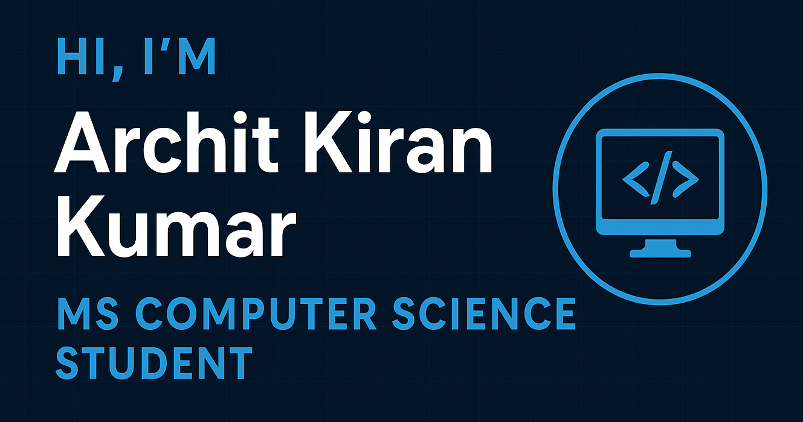

<!-- Banner -->

  

---

<!-- Typing animation -->
<!--

  

-->

---

# 🚀 Archit Kiran Kumar | MS Computer Science Student  

🎓 Master’s in Computer Science @ **Boston University**  
💻 Passionate about **Software Development | Data Science | Web Development| Cybersecurity | Post-Quantum Communication**  
🌱 Currently exploring **Data Science, Front-end development, CyberSecurity**  
⚡ Fun fact: I enjoy going to the gym & building innovative tech projects on the side  

---

## 📌 About Me  
- 🔭 I’m working on **Securing india's EV-Charging Network through OCPP Protocol**  
- 🌐 Interested in **Visualizing data, secure communication, distributed systems, and scalable architectures**  
- 📊 Experienced in **data analysis, visualization, and large-scale systems**  
- 💡 Always open to collaborations on **open-source projects, research, and hackathons**  

---

## 🛠️ Tech Stack  

**Languages**  

  

**Frameworks & Tools**  

